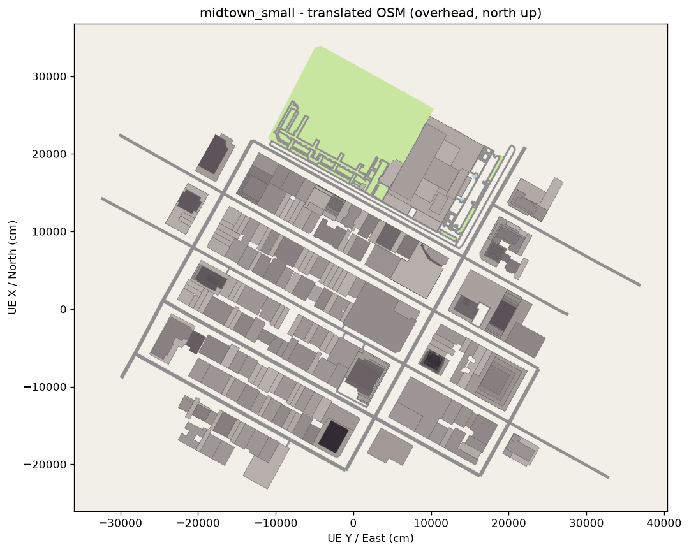

# CityGen — OpenStreetMap → Unreal Engine 5.7 (PCG)

Automated pipeline that reconstructs a real city area in UE 5.7: it fetches
OpenStreetMap data for a bounding box, projects it into UE world space, and generates
extruded building footprints, roads and ground from that data. No hand-modelling.

Default area: **Midtown Manhattan, NYC** (`midtown`), with a smaller
`midtown_small` slice for fast iteration.



## Quick start

```bash
# 1. Python translator
cd pipeline && uv venv --python 3.13 .venv && uv pip install -e . matplotlib && cd ..

# 2. Translate OSM → UE-ready data (writes data/out/<area>/ and Content/Data/)
pipeline/.venv/bin/osm2pcg --area midtown_small

# 3. Compile the UE C++ module and author the level headlessly
tools/build_ue.sh
cp data/out/midtown_small/city.json UnrealProject/Content/Data/city.json
tools/ue_run.sh UnrealProject/Scripts/bootstrap_city_level.py

# or all of the above for an area in one shot:
tools/regen.sh midtown_small
```

Then open `UnrealProject/CityGen.uproject` — `CityLevel` is the default map and
already contains `CityGen_Generator` (`AOSMCityBuilder`). Press **Rebuild City** in its
details panel to regenerate from the current `Content/Data/city.json`.

Requires UE 5.7 at `/Users/Shared/Epic Games/UE_5.7` (override with `UE_ROOT`), Xcode
command-line tools, and `uv` (or any Python ≥ 3.10 + pip).

## Data flow

```
Overpass API ──fetch──► data/raw/osm_<area>.json
                        data/raw/<area>.geojson        (WGS84, for QGIS/map overlay)
       │
       ├─parse──► buildings (rings + height + height_source), roads (centrelines +
       │          width), water/parks
       │
       ├─project──► local Transverse Mercator centred on the bbox centre
       │            → metres → ×100 → UE cm, +X = North, +Y = East
       │
       └─export──► data/out/<area>/{city,buildings,roads,areas,manifest}.json
                   data/out/<area>/{buildings,roads}.csv   (DataTable-shaped)
                        │
                        ▼
                   UnrealProject/Content/Data/city.json
                        │  UOSMCityDataLibrary::LoadCityFromJsonFile
                        ▼
     PCG_City graph:  OSM City Source ──Buildings──► Spawn Dynamic Mesh
                                      ──Roads─────► Spawn Dynamic Mesh
                                      ──Ground────► Spawn Dynamic Mesh
                                      ──RoadSplines► (spare pin for spline meshes)
                        │  run by the PCGComponent on BP_CityGenerator in CityLevel
                        ▼
                   PCG-managed dynamic mesh components (regenerate = replace)
```

`AOSMCityBuilder` builds the identical geometry without PCG; both call
`UOSMCityGeometry`, so the reference path and the PCG path cannot drift.

`manifest.json` records the exact projection string, origin lat/lon, scene bounds and a
histogram of where each building's height came from — everything needed to re-run or
to check georegistration.

## Heights

Per building, in order: `height` tag → `building:height` → `building:levels` (+
`roof:levels`) × 3.2 m → per-`building=*` type estimate → 12 m. For `midtown_small`,
317 / 343 buildings have a real `height` tag, so the skyline is data-driven rather
than guessed.

## Status

- [x] Fetch / parse / project / export (`pipeline/osm2pcg`)
- [x] C++ loader + dynamic-mesh generation (`UOSMCityGeometry`)
- [x] Headless, reproducible `CityLevel` authoring
- [x] PCG graph `PCG_City` + `BP_CityGenerator` consuming the same exports
- [ ] `report.md` with overhead generated-vs-OSM side-by-side
- [ ] `demo/demo.mp4` (30–90 s fly-through)

Data © OpenStreetMap contributors, ODbL.
