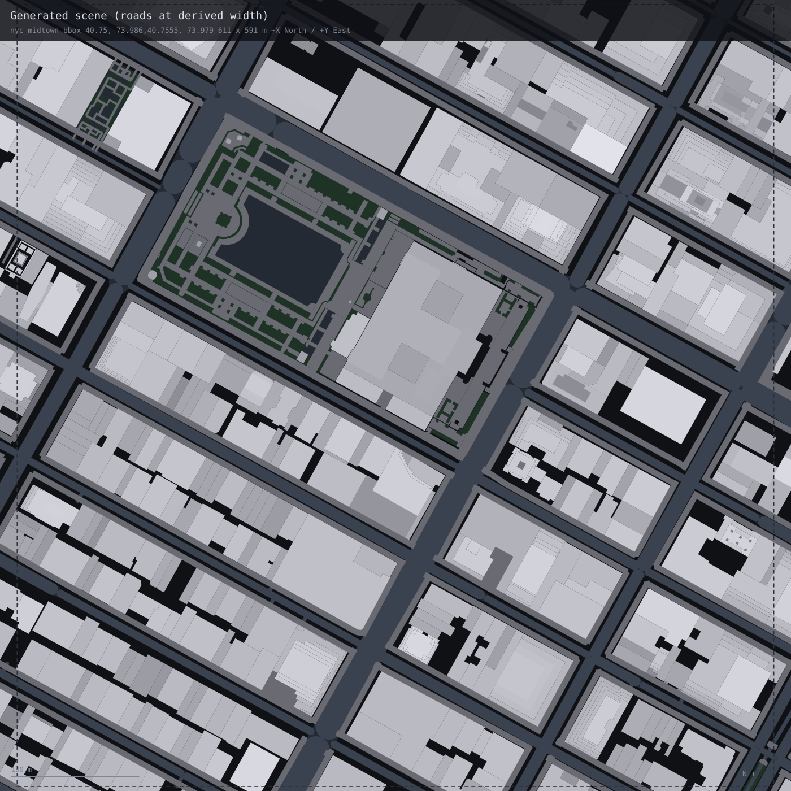

# CityGen — OpenStreetMap → Unreal Engine 5.7 (PCG)

Reconstruction of a real city area in UE 5.7, generated through the PCG framework from
OpenStreetMap data. No hand-modelling: every volume, road and surface in the scene is
derived from the source extract by a translator that runs end to end from one command.

---

## 1. Area and data source


|                   |                                                                                                                            |
| ----------------- | -------------------------------------------------------------------------------------------------------------------------- |
| **Place** | Midtown Manhattan, New York City, USA — West/East 36th to 45th Street, 6th Avenue to Park Avenue. Bryant Park and the New York Public Library sit in the north-west quadrant |
| **Bounding box**  | `south 40.7500, west −73.9860, north 40.7555, east −73.9790` (WGS84)                                                       |
| **Ground extent** | 611 m north–south × 591 m east–west = 0.36 km², about **27 Manhattan blocks** (9 street intervals × 3 avenue intervals) |
| **Source**        | [OpenStreetMap](https://www.openstreetmap.org/#map=17/40.75275/-73.98250) via the [Overpass API](https://overpass-api.de/) |
| **Snapshot**      | Pinned with `[date:"2026-08-15T00:00:00Z"]`, so a re-run returns the same data                                             |
| **Licence**       | Data © OpenStreetMap contributors, [ODbL 1.0](https://opendatacommons.org/licenses/odbl/)                                  |
| **Extract**       | 3,024 elements, fetched with a 150 m buffer so boundary features arrive whole                                              |


The area was chosen by measurement rather than taste. Twenty-three candidate districts
were scored on **how much of their footprint area has a stated height rather than a
guessed one** (`docs/area_survey.md`). Midtown finished with ~1% of footprint area needing
guesswork: 606 of 713 buildings state `height`, and 1,078 of 1,083 `building:part`
volumes state their own. It also contains every hard case in one place — parts overlapping
their parents, roofs with `roof:height`, setbacks starting above ground, and **zero** roads
carrying a `width` tag.

The scope is deliberate: a few city blocks to a small district. At 0.36 km² this sits at
the district end — 27 blocks, 1,651 building volumes, 18.7 km of carriageway — large
enough that the street grid, the block structure and a real skyline range (3.7 m to 397 m)
are all present, and small enough that every feature can be checked against the source
rather than sampled.

---


## 2. The pipeline


### Data flow

```
data/areas.json ──► bbox
     │
     ▼
Overpass API ──fetch──► data/raw/osm_nyc_midtown.json      raw payload, untouched
   (cached,             data/raw/nyc_midtown.geojson       every OSM tag preserved
    date-pinned)        data/raw/nyc_midtown.fetch.json    bbox, endpoint, query, licence
     │
     ├─inspect──► tag coverage, ring extrudability, road cross-section, junction count
     ├─fit──────► storey height, lane counts, height estimator — from THIS area only
     ├─project──► WGS84 → local tangent plane → centimetres
     ├─resolve──► building:part vs parent, roofs inside heights, pedestrian subsets
     └─emit─────► data/ue/nyc_midtown/scene.json
                       │  tools/stage_area.sh
                       ▼
                  UnrealProject/Content/Data/City/scene.json
                       │  UOSMCityDataLibrary::LoadSceneFromDirectory
                       ▼
                  PCG_City graph → dynamic mesh components
```

The whole translation is **one self-contained file**, `agent_scripts/nyc_midtown/pipeline.py`
(2,163 lines, standard library only — no pyproj, shapely or numpy). On a clean checkout
with an empty `data/raw`, `python3 agent_scripts/nyc_midtown/pipeline.py --area nyc_midtown`
fetches from Overpass and writes the scene. Re-running reuses the cache and produces a
byte-identical file.

### Projection and origin

- **Origin**: the centre of the *requested* bbox — `40.75275, −73.98250`. The 150 m fetch
buffer deliberately does not move it.
- **Projection**: a local tangent plane at the origin, using the WGS84 radii of curvature
(meridional and normal) rather than a spherical approximation. `111320·cos(lat)` drifts
0.1–0.2% per kilometre, which is metres of error across a city block.
- **Units**: centimetres, rounded to whole cm on output.
- **Axes**: `+X = North`, `+Y = East`, `+Z = Up`. A top-down view in the editor therefore
reads north-up and east-right, matching a map.

Checked against an independent Vincenty computation: **0.0000% north–south, 0.0001%
east–west** scale error. The verifier reprojects 409 sampled vertices with its own
implementation and finds a worst-case deviation of **0.7 cm**.

### How heights are derived

Preference order, with every result carrying its provenance in the node's `attrs`:


| source                             | volumes | share     |
| ---------------------------------- | ------- | --------- |
| `tag:height` — stated by OSM | 1,608 | **97.6%** |
| `knn[...]` — fitted from this area | 32 | 1.9% |
| `building:levels × 3.883 m`        | 5       | 0.3%      |
| `area_median:26.25m`               | 3       | 0.2%      |


- **Storey height** was fitted here, not carried in: 119 buildings in this extract state
both `height` and `building:levels`, giving a median of **3.883 m/storey**
(leave-one-out MedAE 2.52 m).
- **The estimator had to earn its place.** kNN over log footprint area, type-restricted
where a `building=*` type had ≥7 labelled peers, *k* chosen by leave-one-out over
{3,5,7,9,11,15} → k=15, **MedAE 6.60 m against the area-median baseline's 12.35 m**.
Type medians (MedAE 10.7 m) and spatial neighbours were tried and dropped — in Midtown a
tower sits next to a loft, and nearly every building is `building=yes`.
- `building:part` **resolves against its parent.** 120 parent outlines are suppressed
because their parts describe the massing; extruding both would double-build every tower
and bury the setbacks inside a slab. 185 volumes start above ground from `min_height` /
`building:min_level`.
- **Roof height is contained in the total height** (OSM Simple 3D Buildings), so walls stop
at `height − roof:height`. 114 roof meshes for 115 non-flat `roof:shape` values.
- **Nothing is dropped for lacking a height.** A footprint with an honestly-labelled
estimate beats a hole in the city.

Resulting distribution: median **45.1 m**, 90th percentile 105 m, max **397 m** (the Empire
State Building's roof — correctly excluding its 443 m antenna, which is a separate part).

Road widths could not be fitted at all: **no driveable way in this extract states** `width`.
Rather than invent one, the widths are composed from the cross-section the data *does*
state — `lanes`, `lanes:bus`, `parking:*=lane`, `cycleway:*=lane|track` — multiplied by
NYCDOT Street Design Manual figures, and every one is labelled as borrowed, e.g.
`lanes*3.05m@nycdot_travel_lane:3.05m+lanes:bus*2`. Never laundered as a local fit.

### How the PCG graph consumes it

`scene.json` is the only file the engine reads, and it knows nothing about OpenStreetMap —
no tag names, no highway classes, no roof vocabulary. Everything arrives as one of three
geometric primitives:


| kind      | geometry                                  | used for                            |
| --------- | ----------------------------------------- | ----------------------------------- |
| `extrude` | closed CCW ring + `base_cm` + `height_cm` | building volumes; also sidewalks, plazas and islands as curb prisms |
| `mesh` | indexed triangles, absolute coordinates | roofs, junction caps, ground cover |
| `ribbon`  | polyline + `width_cm`                     | road carriageways                   |


`kind` is a *geometric primitive, never a feature type* — a canal would be a `ribbon`
tagged `water`. That is what lets a new feature class ship without touching C++.

```
PCG_City:   OSM City Source ──Meshes───► Spawn Dynamic Mesh
   (custom C++ node)        ──Splines──► (unconnected; ready for a spline-mesh road pass)
```

`UPCGOSMCitySettings` loads the scene, builds `extrude`/`mesh`/`ribbon` into one dynamic
mesh per node with the node's tags attached, and emits one spline per ribbon centreline.
Everything arrives on a **single** `Meshes` pin rather than one pin per feature class, so a
class the pipeline invents later needs no new pin and no C++ change.

`BP_CityGenerator` derives from `ACityGeneratorActor`, which owns the `PCGComponent` and
calls `Generate` from its construction script — opening `CityLevel` regenerates the city
with no manual step. Spawned components are PCG-managed, so regeneration replaces them
instead of stacking. `AOSMCityBuilder` builds identical geometry without PCG as a reference
path; both call `UOSMCityGeometry`, so the two cannot drift.

Confirmed in the editor:

```
LogOSMCity:    loaded 'nyc_midtown': 2294 extrude, 344 mesh, 173 ribbon (0 skipped)
LogPCGOSMCity: OSM City Source: area 'nyc_midtown' -> 2294 extruded, 1781 triangles,
               173 ribbons, 173 splines
```

---


## 3. Visual comparison

**Left: OpenStreetMap. Right: the generated city in Unreal Engine 5.7.** Same ground, same
extent, same scale, north up in both — 611 x 591 m, the requested bbox exactly, at 1.71
pixels per metre.

<table>
<tr>
<td width="50%"></td>
<td width="50%"></td>
</tr>
<tr>
<td align="center"><em>OpenStreetMap source</em></td>
<td align="center"><em>Generated, in Unreal Engine 5.7</em></td>
</tr>
</table>

Bryant Park sits upper-left in both, with the New York Public Library as the large block on
its east edge; the ~29-degree-east-of-north street grid, the block pattern and the
individual footprints register between the panels.

The UE panel is a real editor screenshot, not a re-render of the data: taken top-down from
1,200 m at 4096 px and cropped to the requested bbox, so that the perspective is mild
enough to lay beside a map. Shot high and cropped deliberately - from 330 m the same
viewport leans every tower outward from the centre, which cannot honestly be compared with
an overhead map. Buildings still lean slightly towards the frame edges; that is a
perspective viewport, not a projection error in the data.

Roads read differently between the panels by nature, not by error: OSM stores road
**centrelines** with no width, while the scene carries **derived carriageway widths** plus
sidewalks, plazas and junction caps. That difference is most of what the translation does.

The same ground once more, drawn from the emitted `scene.json` rather than screenshotted -
useful for reading the data as data, with buildings shaded by height:



Reproduce all three:

```bash
tools/render_overhead.py --area nyc_midtown     # SVG panels, from source and from scene
# take the capture:
#   UnrealEditor CityGen.uproject -ExecCmds="py UnrealProject/Scripts/overhead_shot.py"
tools/crop_overhead.py --area nyc_midtown       # crop to the bbox, match the pair
```

---


## 4. Self-assessment


### What matches well

**Georegistration and orientation are effectively exact.** Scale error against Vincenty is
0.0001%; the median road bearing recomputed from lon/lat is 118.2° against the scene's
118.6°, a 0.5° delta on Manhattan's ~29°-east-of-north grid. Put the two overheads side by
side and the block pattern registers.

**Footprints are faithful.** 1,648 volumes from 1,779 source building features (93%; the
difference is the 120 deliberately-suppressed parents and 3 underground stations). All rings counter-clockwise, no
self-intersections, no degenerate rings, and the source extract had none to repair.

**Heights are data, not decoration.** 97.6% come straight from `height`. The skyline is
right because Midtown states it, not because it was modelled — and where it doesn't, the
estimator was validated against a baseline before shipping, and refused to fit lane widths
at all rather than invent them.

**The street network is a network, not a set of centrelines.** 173 carriageway ribbons with
17 distinct widths composed from the real cross-section, 87 junctions resolved by trimming
and capping, and a pedestrian realm built as **curb prisms rather than floating plates** —
444 sidewalks, 59 plazas and 24 traffic islands, each an `extrude` from `base_cm: 0` to a
16–19 cm top, so they have a curb face and sit on the ground instead of hovering over it.

**The ground is ground, and the underground stays under it.** 143 ground-cover surfaces —
106 gardens, 17 flowerbeds, 6 parks, 6 sand, 3 pitches, 2 playgrounds, 1 water — stacked a
centimetre apart between the slab and the carriageway, so Bryant Park reads as a park rather
than as the footways crossing it. Meanwhile one test (`location=underground`, `layer<0`,
`tunnel`, `indoor`, `level<0`) keeps 3 station buildings, 124 railway ways and 103 indoor
and tunnel footways out of the street level — including Grand Central's underground
concourse, while keeping the terminal building above it.

**It reproduces.** Same input → byte-identical output, verified. One command from nothing:
fetch, translate, verify.

### Known limitations

**The scene still overruns its bounding box, now for a much smaller reason.** It spans
1,438 x 1,245 m against a 611 x 591 m request. The cause is no longer three underground
station complexes standing on the street — those are excluded now, and the largest building
in the scene is 154 m across rather than 737 m. What remains is Overpass returning any
intersecting way in full, so long through-streets run out past the boundary at their true
length. Boundary features arriving complete is what the fetch buffer is for; a footprint cut
in half is a worse error than a margin. The emitted extent is recorded next to the requested
bbox so the difference is visible rather than surprising.

**Nine sidewalks were dropped as bad rings.** Turning a sidewalk centreline into a curb
prism means offsetting the polyline both ways into a closed ring, and after rounding to
whole centimetres nine of 453 came out self-intersecting and were discarded with a counted
reason rather than emitted as tangled solids. 444 survive. A proper offset with mitred
joins would recover them.

**Deliberate omissions**, each counted in the manifest with its reason: 241 pedestrian
crossings (they lie *on* the carriageway by definition and would z-fight it), 103 indoor,
tunnel and below-grade footways, 124 below-grade railway ways, 3 below-grade station
buildings, 51 at-grade steps (a stair is not a flat strip), 16 fountain rims that are lines
rather than polygons, 5 elevators, 3 interior rings — so three courtyards are filled — 2
service parking pads, and 1 mansard roof whose `roof:height` is missing.

**Twelve district-scale landuse polygons were skipped**, two of them 700–900 m across.
They are `landuse=commercial`, `construction` and `brownfield` covering whole districts, not
city blocks, and laying them over the ground would have painted the entire area one colour.
Which leaves the honest gap: **there are still no blocks or parcels.** A city block is not
an OSM object — this extract has three `landuse=commercial` polygons for dozens of blocks —
so blocks would have to be derived as faces of the road graph, and that is not done.

**Sidewalk width is borrowed, and it is doing a lot of work.** Not one sidewalk in the
extract states `width`, so all 444 use NYCDOT's 4.57 m commercial figure. It is the single
assumption a reviewer should push on hardest. It is at least labelled as borrowed rather
than presented as a local fit.

**Materials are untextured grey-box** (not part of the brief), and the `RoadSplines` output
is emitted but unconsumed — the road pass is ribbons, not spline meshes.

### What I would improve with more time, in priority order

1. **Blocks from the road graph.** The one structural thing still missing. The road
   centrelines form a planar graph and a block is a face of it, inset by half the adjacent
   street widths. Nothing in OSM will hand this over.
2. **Model the underground rather than only excluding it.** 3 station buildings, 124 railway
   ways and 103 footways are correctly kept out of the street level, but they describe a
   real network — stations, platforms and passages at their stated `layer` — which is
   currently thrown away rather than built.
3. **Mitred sidewalk offsets**, to recover the nine dropped rings and stop the failure mode
   recurring on a curvier city.
4. **Spline-mesh roads** off the `RoadSplines` pin, with lane markings, which is what the
   pin was left connected-ready for.
5. **A height-fidelity metric.** The verifier checks that heights come from real tags; it
   does not measure *error*. Holding out stated heights and scoring the estimator against
   them per area would turn "plausible" into a number.
6. **Fetch-time trimming of very long ways**, if the extent overrun ever matters visually —
   though keeping boundary features whole is the right default.


### Verification

Everything above is checked by `osm_verify_scene`, which re-derives from the raw OSM
extract rather than reading the pipeline's own manifest — reprojecting sample vertices,
recomputing road bearings from lon/lat, counting source features, and comparing the emitted
height-provenance histogram against the tag coverage the source actually has:

```
ok=True  errors=0  warnings=0
nodes: extrude 2294, mesh 344, ribbon 173, total 2811
  origin matches the requested bbox centre
  worst vertex 0.7 cm from an independent WGS84 tangent-plane projection (409 sampled)
  median road bearing 118.6° vs 118.2° recomputed from source (delta 0.5°)
  1648 volumes from 1779 source building features (93%)
  98% of building volumes cite a stated tag; source share is 94%
```

Reproduce with:

```bash
python3 agent_scripts/nyc_midtown/pipeline.py --area nyc_midtown --verify
tools/verify_area.sh nyc_midtown
tools/stage_area.sh nyc_midtown
tools/render_overhead.py --area nyc_midtown        # regenerates the SVG panels
```

---

Data © OpenStreetMap contributors, ODbL 1.0.