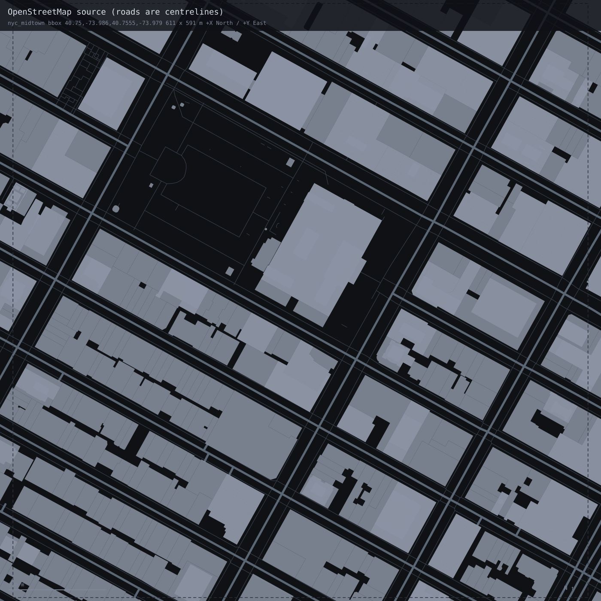

# CityGen — OpenStreetMap → Unreal Engine 5.7 (PCG)

Reconstruction of a real city area in UE 5.7, generated through the PCG framework from
OpenStreetMap data. No hand-modelling: every volume, road and surface in the scene is
derived from the source extract by a translator that runs end to end from one command.

---

## 1. Area and data source

| | |
|---|---|
| **Place** | Midtown Manhattan, New York City, USA — Bryant Park and the blocks around it, between roughly 40th–42nd St and 5th–6th Ave |
| **Bounding box** | `south 40.7500, west −73.9860, north 40.7555, east −73.9790` (WGS84) |
| **Ground extent** | 611 m north–south × 591 m east–west |
| **Source** | [OpenStreetMap](https://www.openstreetmap.org/#map=17/40.75275/-73.98250) via the [Overpass API](https://overpass-api.de/) |
| **Snapshot** | Pinned with `[date:"2026-08-15T00:00:00Z"]`, so a re-run returns the same data |
| **Licence** | Data © OpenStreetMap contributors, [ODbL 1.0](https://opendatacommons.org/licenses/odbl/) |
| **Extract** | 3,024 elements, fetched with a 150 m buffer so boundary features arrive whole |

The area was chosen by measurement rather than taste. Twenty-three candidate districts
were scored on **how much of their footprint area has a stated height rather than a
guessed one** (`docs/area_survey.md`). Midtown finished with ~1% of footprint area needing
guesswork: 606 of 713 buildings state `height`, and 1,078 of 1,083 `building:part`
volumes state their own. It also contains every hard case in one place — parts overlapping
their parents, roofs with `roof:height`, setbacks starting above ground, and **zero** roads
carrying a `width` tag.

---

## 2. The pipeline

### Data flow

```
data/areas.json ──► bbox
     │
     ▼
Overpass API ──fetch──► data/raw/osm_nyc_midtown.json      raw payload, untouched
   (cached,             data/raw/nyc_midtown.geojson       every OSM tag preserved
    date-pinned)        data/raw/nyc_midtown.fetch.json    bbox, endpoint, query, licence
     │
     ├─inspect──► tag coverage, ring extrudability, road cross-section, junction count
     ├─fit──────► storey height, lane counts, height estimator — from THIS area only
     ├─project──► WGS84 → local tangent plane → centimetres
     ├─resolve──► building:part vs parent, roofs inside heights, pedestrian subsets
     └─emit─────► data/ue/nyc_midtown/scene.json
                       │  tools/stage_area.sh
                       ▼
                  UnrealProject/Content/Data/City/scene.json
                       │  UOSMCityDataLibrary::LoadSceneFromDirectory
                       ▼
                  PCG_City graph → dynamic mesh components
```

The whole translation is **one self-contained file**, `agent_scripts/nyc_midtown/pipeline.py`
(2,163 lines, standard library only — no pyproj, shapely or numpy). On a clean checkout
with an empty `data/raw`, `python3 agent_scripts/nyc_midtown/pipeline.py --area nyc_midtown`
fetches from Overpass and writes the scene. Re-running reuses the cache and produces a
byte-identical file.

### Projection and origin

- **Origin**: the centre of the *requested* bbox — `40.75275, −73.98250`. The 150 m fetch
  buffer deliberately does not move it.
- **Projection**: a local tangent plane at the origin, using the WGS84 radii of curvature
  (meridional and normal) rather than a spherical approximation. `111320·cos(lat)` drifts
  0.1–0.2% per kilometre, which is metres of error across a city block.
- **Units**: centimetres, rounded to whole cm on output.
- **Axes**: `+X = North`, `+Y = East`, `+Z = Up`. A top-down view in the editor therefore
  reads north-up and east-right, matching a map.

Checked against an independent Vincenty computation: **0.0000% north–south, 0.0001%
east–west** scale error. The verifier reprojects 409 sampled vertices with its own
implementation and finds a worst-case deviation of **0.7 cm**.

### How heights are derived

Preference order, with every result carrying its provenance in the node's `attrs`:

| source | volumes | share |
|---|---|---|
| `tag:height` — stated by OSM | 1,608 | **97.4%** |
| `knn[...]` — fitted from this area | 35 | 2.1% |
| `building:levels × 3.883 m` | 5 | 0.3% |
| `area_median:26.25m` | 3 | 0.2% |

- **Storey height** was fitted here, not carried in: 119 buildings in this extract state
  both `height` and `building:levels`, giving a median of **3.883 m/storey**
  (leave-one-out MedAE 2.52 m).
- **The estimator had to earn its place.** kNN over log footprint area, type-restricted
  where a `building=*` type had ≥7 labelled peers, *k* chosen by leave-one-out over
  {3,5,7,9,11,15} → k=15, **MedAE 6.60 m against the area-median baseline's 12.35 m**.
  Type medians (MedAE 10.7 m) and spatial neighbours were tried and dropped — in Midtown a
  tower sits next to a loft, and nearly every building is `building=yes`.
- **`building:part` resolves against its parent.** 120 parent outlines are suppressed
  because their parts describe the massing; extruding both would double-build every tower
  and bury the setbacks inside a slab. 185 volumes start above ground from `min_height` /
  `building:min_level`.
- **Roof height is contained in the total height** (OSM Simple 3D Buildings), so walls stop
  at `height − roof:height`. 114 roof meshes for 115 non-flat `roof:shape` values.
- **Nothing is dropped for lacking a height.** A footprint with an honestly-labelled
  estimate beats a hole in the city.

Resulting distribution: median **45.2 m**, 90th percentile 105 m, max **397 m** (the Empire
State Building's roof — correctly excluding its 443 m antenna, which is a separate part).

Road widths could not be fitted at all: **no driveable way in this extract states `width`**.
Rather than invent one, the widths are composed from the cross-section the data *does*
state — `lanes`, `lanes:bus`, `parking:*=lane`, `cycleway:*=lane|track` — multiplied by
NYCDOT Street Design Manual figures, and every one is labelled as borrowed, e.g.
`lanes*3.05m@nycdot_travel_lane:3.05m+lanes:bus*2`. Never laundered as a local fit.

### How the PCG graph consumes it

`scene.json` is the only file the engine reads, and it knows nothing about OpenStreetMap —
no tag names, no highway classes, no roof vocabulary. Everything arrives as one of three
geometric primitives:

| kind | geometry | used for |
|---|---|---|
| `extrude` | closed CCW ring + `base_cm` + `height_cm` | building volumes, any prism |
| `mesh` | indexed triangles, absolute coordinates | roofs, plazas, sidewalks, junctions |
| `ribbon` | polyline + `width_cm` | road carriageways |

`kind` is a *geometric primitive, never a feature type* — a canal would be a `ribbon`
tagged `water`. That is what lets a new feature class ship without touching C++.

```
PCG_City:   OSM City Source ──Meshes───► Spawn Dynamic Mesh
   (custom C++ node)        ──Splines──► (unconnected; ready for a spline-mesh road pass)
```

`UPCGOSMCitySettings` loads the scene, builds `extrude`/`mesh`/`ribbon` into one dynamic
mesh per node with the node's tags attached, and emits one spline per ribbon centreline.
Everything arrives on a **single** `Meshes` pin rather than one pin per feature class, so a
class the pipeline invents later needs no new pin and no C++ change.

`BP_CityGenerator` derives from `ACityGeneratorActor`, which owns the `PCGComponent` and
calls `Generate` from its construction script — opening `CityLevel` regenerates the city
with no manual step. Spawned components are PCG-managed, so regeneration replaces them
instead of stacking. `AOSMCityBuilder` builds identical geometry without PCG as a reference
path; both call `UOSMCityGeometry`, so the two cannot drift.

Confirmed in the editor:

```
LogOSMCity:    loaded 'nyc_midtown': 1651 extrude, 864 mesh, 173 ribbon (0 skipped)
LogPCGOSMCity: OSM City Source: area 'nyc_midtown' -> 1651 extruded, 5028 triangles,
               173 ribbons, 173 splines
```

---

## 3. Visual comparison

**Generated scene in Unreal Engine 5.7**, top-down from 330 m. Bryant Park is centre-left
with its path network; the New York Public Library is the stepped block on its east edge.


Below, the same ground drawn twice from the two ends of the pipeline — **left: the
OpenStreetMap source**, **right: the emitted `scene.json`** — in one projection and one
viewport, north up, 100 m scale bar:

| OpenStreetMap source | Generated scene |
|---|---|
|  |  |

Roads read differently between the two panels by nature, not by error: OSM stores road
**centrelines** with no width, while the scene carries **derived carriageway widths** plus
sidewalks, plazas and junction caps. That difference is most of what the translation does.

Both panels come from `tools/render_overhead.py`, which re-derives from the source files
with the same projection the pipeline uses — standard library only, deterministic.

---

## 4. Self-assessment

### What matches well

**Georegistration and orientation are effectively exact.** Scale error against Vincenty is
0.0001%; the median road bearing recomputed from lon/lat is 118.2° against the scene's
118.6°, a 0.5° delta on Manhattan's ~29°-east-of-north grid. Put the two overheads side by
side and the block pattern registers.

**Footprints are faithful.** 1,651 volumes from 1,779 source building features (93%; the
difference is the 120 deliberately-suppressed parents). All rings counter-clockwise, no
self-intersections, no degenerate rings, and the source extract had none to repair.

**Heights are data, not decoration.** 97.4% come straight from `height`. The skyline is
right because Midtown states it, not because it was modelled — and where it doesn't, the
estimator was validated against a baseline before shipping, and refused to fit lane widths
at all rather than invent them.

**The street network is a network, not a set of centrelines.** 173 carriageway ribbons with
17 distinct widths composed from the real cross-section, 87 junctions resolved by trimming
and capping, 453 mapped sidewalks, 59 plaza surfaces, 24 traffic islands — while the 88
below-grade subway passages and indoor concourses stay correctly excluded.

**It reproduces.** Same input → byte-identical output, verified. One command from nothing:
fetch, translate, verify.

### Known limitations

**The scene overruns its bounding box, and this is the biggest defect.** Overpass returns
any way that *intersects* the query box in full, so a 150 m buffer did not produce a 150 m
margin: the scene spans roughly 1,440 × 1,570 m for a 611 × 591 m request. **57% of the
volumes and 73% of the ribbons sit outside the area that was asked for.** Nothing clips on
the way out and the manifest does not mention it. The fix is understood — clip buildings
whole-or-not by centroid, clip polylines and polygons at the boundary — but it is not in
this build.

**Raised pedestrian surfaces are flat plates, not prisms.** Sidewalks sit at Z = +19 cm and
plazas at +16 cm with every vertex at a single height, so they have a walking surface but
no curb face and nothing underneath. Correct from altitude, wrong at street level. They
should be `extrude` nodes with `base_cm: 0` — the primitive already supports it.

**There is no ground cover.** The fetch selectors cover buildings and highways only, so
parks, water, landuse and grass are simply absent. Bryant Park appears as *the footways
crossing it* over a bare slab, with no lawn. The ground is a single flat box spanning the
scene; there are no blocks or parcels.

**Deliberate omissions**, each counted in the manifest with its reason: 241 pedestrian
crossings (they lie *on* the carriageway by definition and would z-fight it), 58 at-grade
steps (a stair is not a flat strip), 5 elevators, 5 interior rings — so five courtyards are
filled in — 2 service parking pads, and 1 mansard roof whose `roof:height` is missing.

**Sidewalk width is borrowed, and it is doing a lot of work.** Not one sidewalk in the
extract states `width`, so all 453 use NYCDOT's 4.57 m commercial figure. That puts the
pedestrian surface at 1.07× the carriageway area — plausible for Midtown, but it is the
single assumption a reviewer should push on hardest. It is at least labelled as borrowed.

**Materials are untextured grey-box** (not part of the brief), and the `RoadSplines` output
is emitted but unconsumed — the road pass is ribbons, not spline meshes.

### What I would improve with more time, in priority order

1. **Clip to the requested bbox.** Highest value per hour by a wide margin, and it makes
   the deliverable match its own stated extent.
2. **Curbs as prisms.** A one-primitive change from `mesh` to `extrude` that fixes every
   raised pedestrian surface at street level.
3. **Ground cover** — add `leisure`, `landuse`, `natural`, `water` to the selectors and
   stack them in the 0–4 cm band beneath the carriageway, excluding the 58 below-grade
   `railway=subway` ways. Bryant Park becomes a park.
4. **Blocks from the road graph.** A city block is not an OSM object — this extract has
   three `landuse=commercial` polygons for dozens of blocks — so they would have to be
   derived as faces of the road network, inset by half the adjacent street widths.
5. **Spline-mesh roads** off the `RoadSplines` pin, with lane markings, which is what the
   pin was left connected-ready for.
6. **A height-fidelity metric.** The verifier currently checks that heights come from real
   tags; it does not measure *error*. Holding out stated heights and scoring the estimator
   against them per-area would turn "plausible" into a number.

### Verification

Everything above is checked by `osm_verify_scene`, which re-derives from the raw OSM
extract rather than reading the pipeline's own manifest — reprojecting sample vertices,
recomputing road bearings from lon/lat, counting source features, and comparing the emitted
height-provenance histogram against the tag coverage the source actually has:

```
ok=True  errors=0  warnings=0
nodes: extrude 1651, mesh 864, ribbon 173, total 2688
  origin matches the requested bbox centre
  worst vertex 0.7 cm from an independent WGS84 tangent-plane projection (409 sampled)
  median road bearing 118.6° vs 118.2° recomputed from source (delta 0.5°)
  98% of volumes cite a stated tag; source share is 94%
```

Reproduce with:

```bash
python3 agent_scripts/nyc_midtown/pipeline.py --area nyc_midtown --verify
tools/verify_area.sh nyc_midtown
tools/stage_area.sh nyc_midtown
tools/render_overhead.py --area nyc_midtown        # regenerates both SVGs above
```

---

Data © OpenStreetMap contributors, ODbL 1.0.
